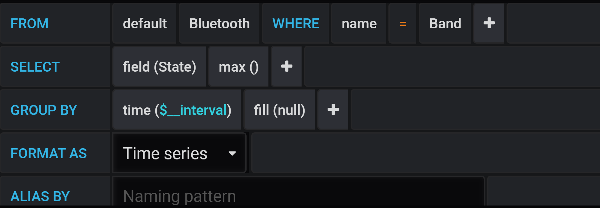
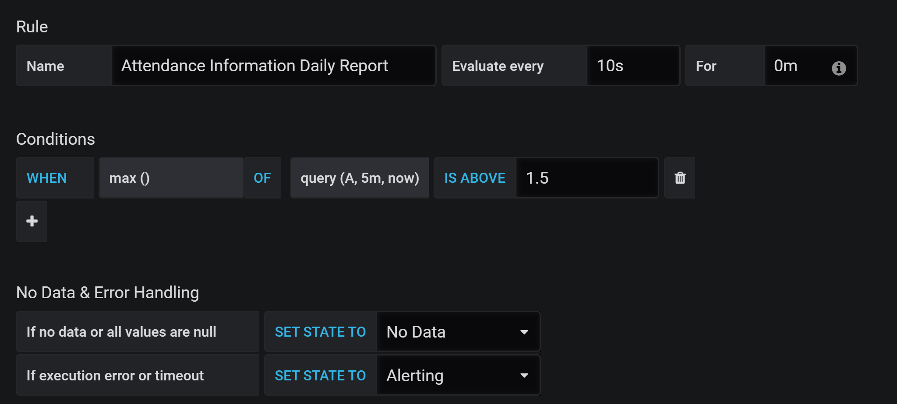
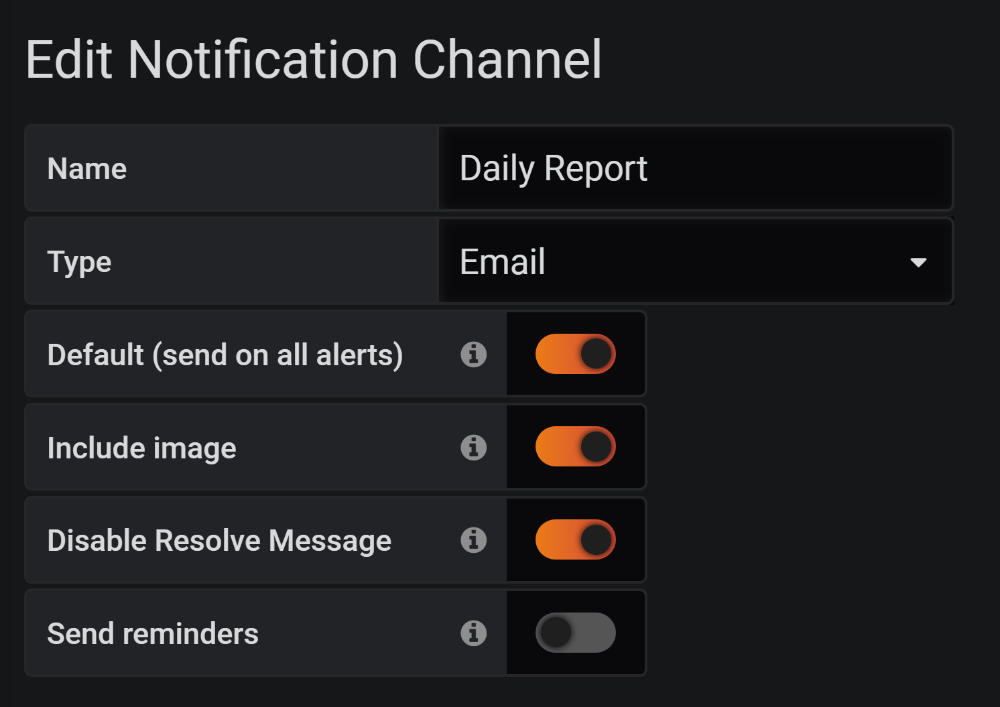

# RPi Bluetooth Attendance Information Collection System

This system helps collect attendance information in a non-inductive way by scanning the nearby bluetooth or BLE device using Raspberry Pi.    
The system stores information in InfluxDB and make the information observable via Grafana.    
Daily report is also supported.


## Installation


#### 1. Clone the repository
```
cd ~
git clone https://github.com/forskamse/RPi-Bluetooth-Attendance-Information-Collection-System.git
```
#### 2. System dependencies
```
[Hardware: Raspberry Pi 4 - 4G RAM Version]
[OS: Raspbian GNU/Linux 10 (buster)]
[HCI Tool: V5.50]
[Influx DB: V1.6.4]
wget -qO- https://repos.influxdata.com/influxdb.key | sudo apt-key add -
echo "deb https://repos.influxdata.com/debian buster stable" | sudo tee /etc/apt/sources.list.d/influxdb.list
sudo apt update
sudo apt install influxdb influxdb-client
[Grafana V6.6.0]
wget https://dl.grafana.com/oss/release/grafana_6.6.0_armhf.deb
sudo dpkg -i grafana_6.6.0_armhf.deb
[Grafana Rendering Plugin]
wget https://nodejs.org/dist/v12.16.0/node-v12.16.0-linux-armv7l.tar.xz
sudo ln -s /home/pi/Projects/node-v12.16.0-linux-armv7l/bin/node /usr/bin/node
sudo ln -s /home/pi/Projects/node-v12.16.0-linux-armv7l/bin/npm /usr/bin/npm
npm -g install yarn
npm -g install typescript
sudo ln -s /home/pi/Projects/node-v12.16.0-linux-armv7l/bin/tsc /usr/bin/tsc
sudo ln -s /home/pi/Projects/node-v12.16.0-linux-armv7l/bin/yarn /usr/bin/yarn
# You should change to root and run the following commands.
su root
cd /var/lib/grafana/plugins/
git clone https://github.com/grafana/grafana-image-renderer.git
cd grafana-image-renderer
make deps
make build
sudo apt install chromium-browser chromium-chromedriver
cd /var/lib/grafana/plugins/grafana-image-renderer/node_modules/puppeteer/.local-chromium/linux-706915/chrome-linux/    # here pls check whether your chrome version number is 706915 or not
mv chrome chrome.bak
cp /usr/bin/chromium-browser /var/lib/grafana/plugins/grafana-image-renderer/node_modules/puppeteer/.local-chromium/linux-706915/chrome-linux/chrome
cd ~
```

#### 3. Python dependencies
Since BLE scanning requires system permission, using system python3 environment is highly recommended. Otherwise you might suffer from some issues on module searching when running the code with sudo permission.
```
sudo pip3 install influxdb apscheduler -i https://pypi.tuna.tsinghua.edu.cn/simple/
```

## Configuration

#### 1. Code modification
- RPi-Bluetooth-Attendance-Information-Collection-System.py

    On considering the security, just write [your_db_pwd] into a txt file.

    Change [your_db_user]. 

    Select tartgetDevType. Change target device names(targetDevName, data type: list) and target device addresses(targetDevAddrs, data type: list). By far, 'Bluetooth' and 'BLE' are not supported at the mean time. But it's very easy to implement based on current codes. If it's necessary for you, you may have a try.

    Set triggers individually for each target device name if necessary.

- start-when-power-on.sh

    Change /path/to/your/Project.

#### 2. InfluxDB configuration
```
sudo systemctl unmask influxdb.service
sudo systemctl enable influxdb
sudo systemctl start influxdb
```
Enter influxdb cli mode(by runing 'influx' on shell):
```
CREATE USER [your_db_user] WITH PASSWORD [your_db_pwd] WITH ALL PRIVILEGES
CREATE DATABASE attendanceInformation
```

#### 3. Grafana configuration

```
## Start grafana-image-renderer server in the background
cd /var/lib/grafana/plugins/grafana-image-renderer/
nohup node build/app.js server --port=8081 &
```

```
## Edit grafana config file
sudo nano /etc/grafana/grafana.ini
#######################################
[smtp]
enabled = true
host = [your_email_smtp_host]
user = [your_email_address]
password = [your_email_passwd]
from_address = [your_email_address]
from_name = Grafana
;For example: 
;[your_email_smtp_host]: smtp.qq.com:465
;[your_email_address]: xxx@qq.com
[rendering]
server_url = http://localhost:8081/render
callback_url = http://localhost:3000/
#######################################
```

```
## Enable and start grafana server
sudo /bin/systemctl daemon-reload
sudo /bin/systemctl enable grafana-server
sudo systemctl start grafana-server
```
Run 'hostname -I' for [your_host_address].

Visit http://[your_host_address]:3000/.
Change admin password when first login with username as 'admin' and password as 'admin'.

Create a dashbord and add data source InfluxDB with [your_db_user] and [your_db_pwd].

Set up query rules:



Some additional query settins help with data observability and default image rendering time range:


Set up alert rules:



'Evaluate every' determines the intervals when the rule is evaluated. 'For' determines the pending duration after the alert rule was triggered.

Set up notification channels:



Here 'Include image' determines whether to send a rendered image or not. 'Disable Resolve Message' prevents from sending another [OK] alerting email once the former alerting situation was resolved.

#### 4. Boot from power on
```
## Add configuration before "exit 0"
sudo nano /etc/rc.local
########################################################
/bin/bash /path/to/your/Project/start-when-power-on.sh
########################################################
```

## Running
```
cd /path/to/your/Project/
nohup sudo python3 RPi-Bluetooth-Attendance-Information-Collection-System.py >> RpiAttendance.log &
```

## Reference
https://pimylifeup.com/raspberry-pi-grafana/

https://github.com/grafana/grafana-image-renderer/blob/master/docs/building_from_source.md

https://github.com/grafana/grafana-image-renderer/issues/7

https://grafana.com/docs/grafana/latest/administration/image_rendering/

https://community.openhab.org/t/tutorial-grafana-rendering-on-raspberry-pi/71777